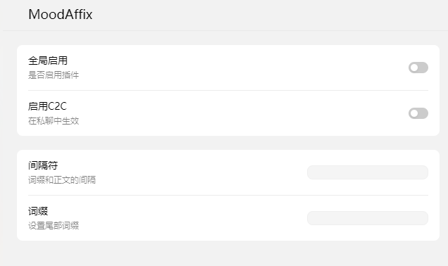
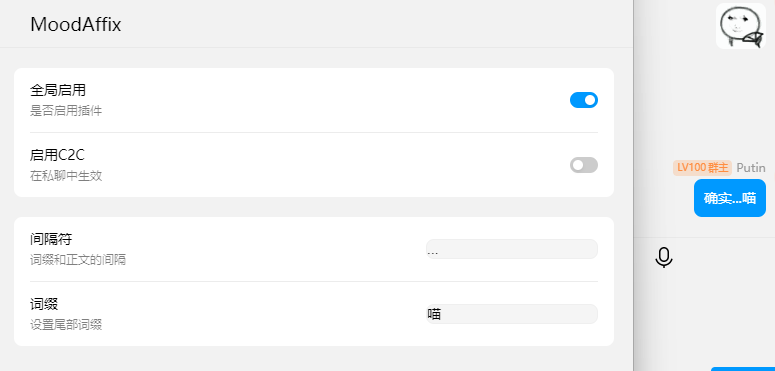

# LiteLoaderQQNT-MoodAffix

用于调整你的语气 其实就是在结尾自动加上你定义的词缀
LiteLoaderQQNT 本体：[LiteLoaderQQNT](https://github.com/mo-jinran/LiteLoaderQQNT)

> [!CAUTION]\
> **此插件可能会和其他类似的hook插件冲突**

## 使用方法

### 使用预构建版本

- 从Release中下载
- 将压缩包中的内容解压到 [LiteLoaderQQNT](https://github.com/mo-jinran/LiteLoaderQQNT) 数据目录的 `plugins` 目录下（注意新建文件夹）
- 重启 QQNT 安装完成

### 手动构建

- 克隆项目
- `npm run build`
- 将 `/dist` 中文件和 `manifast.json` 放进 [LiteLoaderQQNT](https://github.com/mo-jinran/LiteLoaderQQNT) 数据目录的 `plugins` 目录下（注意新建文件夹）
- 重启 QQNT 安装完成

### 配置

目前只做了全局功能和私聊功能，群/人单独设置还没做

**全局启用**：在所有群中启用词缀

**C2C**：私聊中启用词缀 前提是打开全局启用

**间隔符**：正文结尾和词缀之间的间隔符

**词缀**：就是词缀

### 效果

## 就酱喵，白白喵
